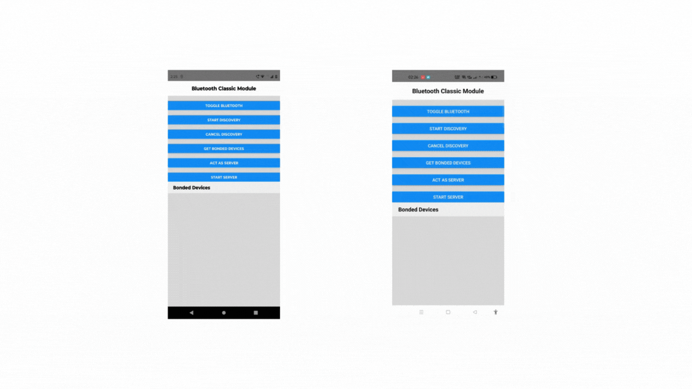

# React-Native Bluetooth Classic Module

## Introduction

Hello everyone! 👋 I'm excited to share my exploration of the new architecture in React-Native and the creation of a basic Bluetooth Classic Module for Android. This module enhances your React-Native app by providing seamless integration with Bluetooth Classic devices.

## Demo

## Module Functionalities

The Bluetooth Classic Module offers the following functionalities:

- Enabling and disabling Bluetooth connections.
- Listing already bonded devices.
- Pairing new devices.
- Starting and stopping the discovery of devices.

## Learning Highlights

During the development of this module, I gained valuable insights into various concepts:

- **Creating Turbo Native Module:** I learned how to build a Turbo Native Module, harnessing the power of the new architecture in React-Native.

- **Strongly Typed Interfaces:** The module includes strongly typed interfaces that expose the module's properties with proper typings, ensuring a smoother integration process.

- **Codegen for Scaffolding:** I explored the usage of Codegen to generate scaffolding code, which significantly expedited the development process.

- **Exposing Native APIs to React-Native:** I delved into the intricacies of exposing native APIs and code to the React-Native environment, enabling seamless communication between the two.

- **Runtime Permissions and Lifecycle Handling:** The process of handling runtime permissions within the app and utilizing Android's lifecycle methods and Activity listeners was a key learning point.

- **Sending Native Events to React-Native:** I discovered how to send native events to the React-Native side or JS thread, enhancing real-time communication between the native and JavaScript parts of the app.

## Getting Started

To integrate the Bluetooth Classic Module into your React-Native app, follow these steps:

1. Clone this repository to your local machine.
2. Navigate to the module's directory and install dependencies.
3. Link the module to your React-Native project.
4. Use the module's functionalities in your app by following the provided documentation and examples.

## Contributions

Contributions are more than welcome! If you find issues, have suggestions, or want to add new features, feel free to open an issue or submit a pull request. Let's collaborate and make this module even better!

## License

This project is licensed under the [MIT License](LICENSE).
